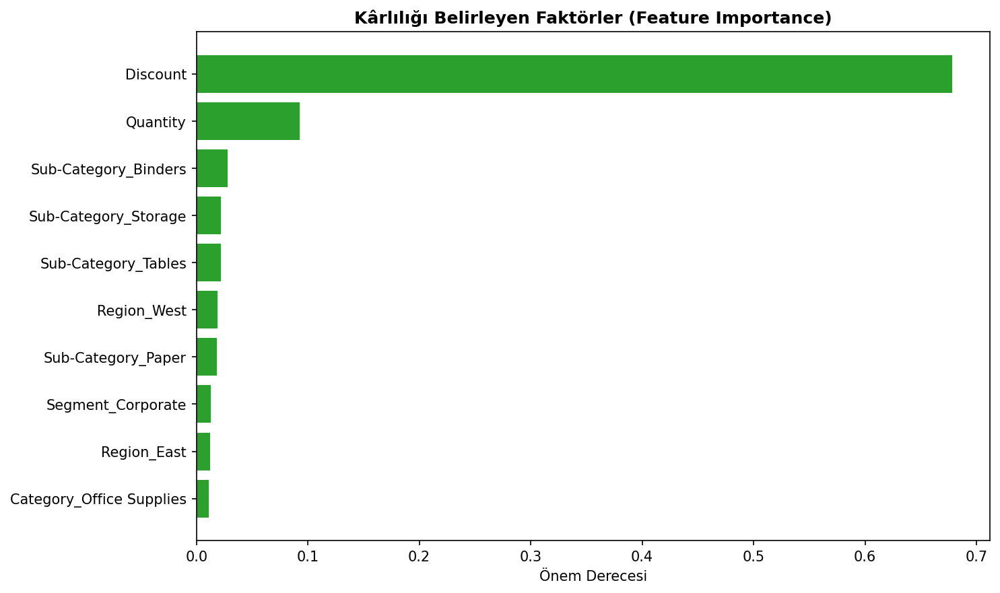

# Superstore Profitability Prediction (Machine Learning)

Superstore satış verisi üzerinde, bir siparişin **kârlı mı zararlı mı** olacağını tahmin eden bir sınıflandırma modeli. Bu proje, daha önceki [SQL/Power BI](https://github.com/MetinHrmnc/superstore-sales-analysis) ve [Pandas](https://github.com/MetinHrmnc/superstore-pandas-analysis) analizlerinin makine öğrenmesi ile devamıdır.

## Proje Amacı
- Sipariş gerçekleşmeden önce bilinen değişkenlerle (indirim, miktar, kategori, segment, bölge) kârlılığı tahmin etmek
- Birden fazla sınıflandırma algoritmasını karşılaştırmak
- Kârlılığı en çok etkileyen faktörleri belirlemek (feature importance)

## Dataset
- **Kaynak:** Kaggle — Superstore Sales Dataset (Vivek)
- **Boyut:** 9.994 satır
- **Hedef değişken:** Karli (Profit > 0 ise 1, değilse 0)

## Kullanılan Teknolojiler
- **Python 3.12**
- **scikit-learn** — model kurma, değerlendirme, feature importance
- **Pandas, NumPy** — veri hazırlama
- **Matplotlib** — görselleştirme

## Yöntem
1. Hedef değişken oluşturma (Profit > 0)
2. Kategorik değişkenleri one-hot encoding ile dönüştürme (`pd.get_dummies`)
3. Train/test ayrımı (%80/%20)
4. Üç model: Logistic Regression, Decision Tree, Random Forest
5. Değerlendirme: accuracy, confusion matrix, precision/recall/f1
6. Feature importance analizi

## Sonuçlar
| Model | Accuracy |
|-------|----------|
| Logistic Regression | %94.3 |
| Random Forest | %93.4 |
| Decision Tree | %93.0 |

- Veri dengesiz olduğu için zararlı sınıfın **recall değeri (%84)** asıl önemli metrik olarak değerlendirildi.
- **Discount**, kârlılığı belirleyen açık ara en önemli faktör (önem derecesi 0.68).

## Öne Çıkan Bulgu
İndirim, kârlılığın 1 numaralı belirleyicisi. Bu sonuç, projenin SQL ve Pandas versiyonlarındaki bulgularla birebir örtüşüyor — aynı içgörüye üç farklı yöntemle ulaşıldı.

## İlgili Projeler
- [Superstore SQL & Power BI Analysis](https://github.com/MetinHrmnc/superstore-sales-analysis)
- [Superstore Pandas Analysis](https://github.com/MetinHrmnc/superstore-pandas-analysis)

## İletişim
**Metin Harmancı** — Akdeniz Üniversitesi, Yönetim Bilişim Sistemleri
[LinkedIn](https://www.linkedin.com/in/metin-harmanc%C4%B1-7b15612a8/)
